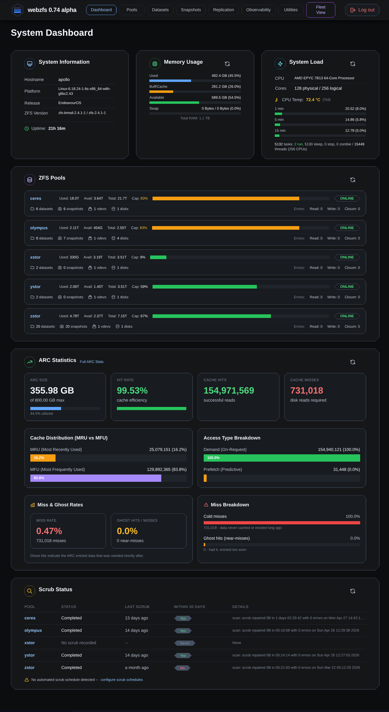

# WebZFS - ZFS Web Management Interface

A modern web-based management interface for ZFS pools, datasets, snapshots, and SMART disk monitoring built with Python FastAPI and HTMX.



***
# Disclaimer
Due to Reddit Drama... I'm making this clear up front. **_This is not a vibe coded project._**

I get people's disgust at at the number of vibe coded projects coming out these days. They're coming from people who dont have experience and knowledge to know what they are doing, and yet they are promising the world.  **I get it, I too am frustrated by this.**  However not every new project you see has beem vibecoded. 

[For context, I wrote this article advising against people using AI with ZFS, so it'd be idiotic for me to vibecode an entire ZFS management engine with AI.](https://klarasystems.com/articles/why-you-cant-trust-ai-to-tune-zfs/)

The core of the application was developed over several years, by myself as a hobby project.
As a former iXsystems employee, I have seen inside the sausage factory of TrueNAS as the saying goes. I wanted to design something different. I started this in the winter of 2022 once I left iXsystems. 

If you dig into the code you will no doubt find a lot of issues and ineffeciencies. (If you find them, please file a bug report so I can fix them). The project has evolved a lot over the years I worked on this.

Where AI was used (and has alwyas been disclosed at the bottom of this readme), was to improve the CSS and implement JS for modal confirmations in UI (see the v0.2 and v0.3 ./screenshots to see the old gnarly UI). As a result it used tailwind because that's the most common thing that it knows, and its easy for AI to implement.  I do plan on replacing that in time, once I find a JS/CSS dev I can hire, becuase I'm not a UI dev.  I also used claude to add some documentation since I was going to be posting this publicly and other people would not have the mental context I have for the project. 

As for my providence with ZFS and as a developer...

- I worked at iXsystems on TrueCommand and TrueNAS for 5 years.
- I have been the producer of BSD Now for over a decade.
- I currently work at Klara Systems as a ZFS Solutions Engineer alongside Allan Jude.
  - (Note: This project is unrelated to my work at KlaraSystems, I started working on this before I started working for Klara)
- I am the current developer and release maintainer for the Lumina Desktop.
- I am a release mainainer for five Fedora Releases.
  - (Fedora Security Lab, Fedora Jam, Fedora Astonomy, Fedora Games Lab, and Fedora Scientific Lab)
- I was a Puppylinux developer, and I also worked on PC-BSD, TrueOS, and Project Trident.

To address some points brought up by people on reddit in a thread someone posted about this:

- The public copyright date is set to 2025 (and not 2022), because that is when I released it publicly. 
- Yes I flattened this repo before I pushed it to github. This is common for me because I work in a private gitea where I commit eveything becuase its "private". I push a clean repo to github. [Read more about this here.](https://www.reddit.com/r/zfs/comments/1rt4eoc/comment/oafnkce/)
- [Former iX employee who I have worked with on many projects openly confirmed I gave him a demo of this in early 2024.](https://www.reddit.com/r/zfs/comments/1rt4eoc/comment/oafss9g/)
- [Another developer I've worked with before also came forward to acknowledge that I gave him a demo of this years ago.](https://www.reddit.com/r/zfs/comments/1rt4eoc/comment/oaitltr/)

Ok... now back to your regularly scheduled README.md...

***

## Features

- **ZFS Pool Management**: Create, import, export, scrub, and monitor ZFS pools
- **Dataset Management**: Create, rename, mount/unmount datasets and volumes
- **Snapshot Management**: Create, destroy, rollback, clone, and diff snapshots
- **Replication Management**: Native ZFS send/receive and Sanoid/Syncoid integration
- **Performance Monitoring**: Real-time pool I/O stats, ARC statistics, and ZFS processes
- **System Observability**: Pool history, events, kernel logs, and module parameters
- **SMART Monitoring**: Disk health, attributes, test scheduling, and error logs
- **Fleet Monitoring**: Monitor multiple remote ZFS servers (optional)
- **Modern UI**: Built with Tailwind CSS and HTMX, utilizing minimal JavaScript
- **User Management**: Relies on PAM to interact with existing local *nix user accounts on the system

## Platform Support

- **Linux**: Any distribution with OpenZFS support
- **FreeBSD**: FreeBSD 13.x and later with OpenZFS
- **NetBSD**: FreeBSD 10.x and later with OpenZFS

The application automatically detects the operating system and adapts its behavior accordingly.

## Quick Start

### Prerequisites

- Linux or FreeBSD with ZFS support
- Python 3.11+
- Node.js v20+ and npm
- ZFS utilities (zpool, zfs, zdb)
- smartmontools (smartctl)
- sanoid (optional)
- smartd (optional)

### Installation

**Linux:**
```bash
git clone https://github.com/webzfs/webzfs.git
cd webzfs
chmod +x install_linux.sh
sudo ./install_linux.sh
```

The installation script automatically:
- Creates a dedicated `webzfs` system user
- Installs the application to `/opt/webzfs`
- Installs all dependencies and builds assets
- Configures sudo permissions

**FreeBSD:**
```bash
git clone https://github.com/webzfs/webzfs.git
cd webzfs
chmod +x install_freebsd.sh
sudo ./install_freebsd.sh
```

The installation script automatically:
- Detects FreeBSD version (14.x or 15.x)
- Downloads pre-compiled wheels from GitHub (no Rust compilation needed)
- Installs required packages via pkg
- Installs the application to `/opt/webzfs`
- Installs all dependencies and builds assets
- Creates an rc.d service script


### Running

On Linux:
```bash
# Start the application
sudo -u webzfs /opt/webzfs/run.sh

# Or for development mode
sudo -u webzfs /opt/webzfs/run_dev.sh
```

On FreeBSD the application must be run as root to avoid issues with PAM:
```bash
# Start the application
/opt/webzfs/run.sh

# Or for development mode
/opt/webzfs/run_dev.sh
```


### Access

Open your browser to: **http://localhost:26619**

**Port 26619?** Z(26) + F(6) + S(19) = ZFS!

**Remote Access:** Use SSH port forwarding for security:
```bash
ssh -L 127.0.0.1:26619:127.0.0.1:26619 user@server
```

## Documentation

- **[BUILD_AND_RUN.md](BUILD_AND_RUN.md)** - Complete installation, configuration, and troubleshooting guide
- **[add_feature_demo/README.md](add_feature_demo/README.md)** - Guide for adding new features

## Configuration

Configuration is stored in `/opt/webzfs/.env`. Key settings:

- `SECRET_KEY` - Change this in production!
- `HOST` - Default: 127.0.0.1 (localhost only)
- `PORT` - Default: 26619

See [BUILD_AND_RUN.md](BUILD_AND_RUN.md) for detailed configuration options.

## System Service

To run WebZFS as a system service that starts on boot, see the complete service setup instructions in [BUILD_AND_RUN.md](BUILD_AND_RUN.md#system-service-setup).


## Project Structure

```
├── auth/               # Authentication and authorization
├── config/             # Application configuration and settings
├── services/           # Core business logic and ZFS/SMART services
├── templates/          # Jinja2 HTML templates
├── views/              # FastAPI route handlers
├── static/             # Generated static assets
└── src/                # Source CSS files
```

## Technology Stack

- **Backend**: Python 3.11, FastAPI, Uvicorn/Gunicorn
- **Frontend**: HTMX, Tailwind CSS, Jinja2 templates
- **ZFS Integration**: Shell command execution with privilege management
- **Authentication**: PAM-based authentication

## Security Considerations

- Runs as dedicated `webzfs` system user with limited sudo permissions (on Linux)
- Binds to 127.0.0.1 by default (localhost only)
- Use SSH port forwarding for remote access
- Change `SECRET_KEY` in production
- Consider running behind a reverse proxy with SSL/TLS

## Development

### Local Development (No Installation Required)

If you want to develop directly from your git clone without installing to `/opt/webzfs`:

```bash
# Clone the repository
git clone https://github.com/webzfs/webzfs.git
cd webzfs

# Run the setup script (only needed once)
chmod +x setup_dev.sh
./setup_dev.sh

# Start the development server
./run_dev.sh
```

The `setup_dev.sh` script will:
- Create a Python virtual environment (`.venv`)
- Install all Python dependencies
- Install Node.js dependencies
- Build static CSS assets
- Create a `.env` configuration file with a secure SECRET_KEY

You can then make changes, commit, and push directly from this directory.

### Development from /opt/webzfs Installation

If you've installed to `/opt/webzfs`:

```bash
cd /opt/webzfs
source .venv/bin/activate
./run_dev.sh
```

### Adding New Features

For adding new features, see [add_feature_demo/README.md](add_feature_demo/README.md).

### CSS Development

To automatically rebuild CSS when modifying Tailwind classes:

```bash
source .venv/bin/activate
npm run watch:css
```

## Contributing

Contributions are welcome! Please submit issues or pull requests.

## License

MIT License - See [LICENSE](LICENSE) file for details.

## Related Projects

- [OpenZFS](https://openzfs.org/) - Open source ZFS implementation
- [Sanoid](https://github.com/jimsalterjrs/sanoid) - Snapshot management and replication
- [SMART tools](https://www.smartmontools.org/) - Disk health monitoring

## Support

- **GitHub**: https://github.com/q5sys/webzfs
- **Issues**: Use the GitHub issue tracker

---

**For detailed installation, configuration, troubleshooting, and system service setup, see [BUILD_AND_RUN.md](BUILD_AND_RUN.md).**


## AI Usage Disclosure

- AI was used to help add comments to the source files as well as to help clean up the build and installation documentation. 
- AI was used to implement Tailwind.CSS which massively improved my previously hideous CSS. (seriously it was eyebleedingly bad, tailwind is much much better) 
- AI was used to help implement the modal JS confirmation dialogs for certain operations, because my prior attempts were rather buggy and needed to be cleaned up. 
- [Ballistic-CodeLlama-34B](https://huggingface.co/BallisticAI/Ballistic-CodeLlama-34B-v1)

## Dev Comments

I started working on this in my spare time in the Winter of 2022.  It's been slow progress, but something I've been slowly building out since then.  It's gone through a few iterations and refactoring but it's to the point where I'm happy with where it's at for my needs.

My primary focus was to design a transparent UI that interfaces with the system and doesn't rely on its own database, data collection tooling, or custom tooling to interact with the OS. While not the best for everyone, what I wanted was something that's just a UI front end to the tooling I normally would interact with on the CLI.  So I decided to use an ASGI python server and build out the code to use and run the same tooling I would as a sysadmin. These tools already exist and work, so I dont see any reason for me to try to re-invent the wheel.

FYI: You cannot delete pools or datasets with the UI, you will need to do that at the CLI. That was an intentional design choice.
