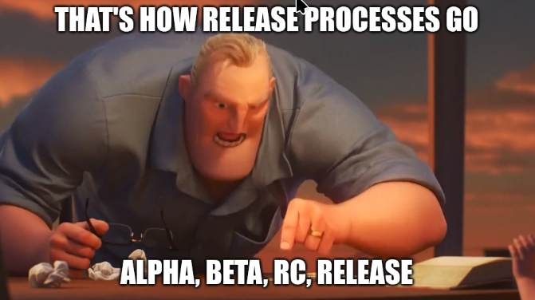
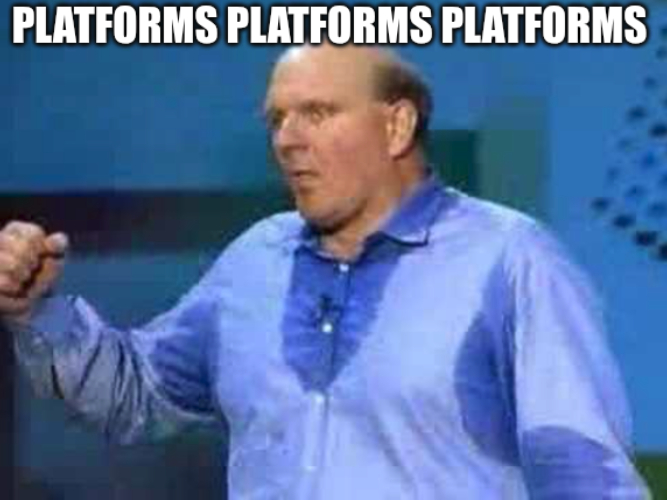

# Software projects come... software projects go... War never changes...err... Software Development never changes. 

Well, this one feels good to write.

Back in December of 2025, after years of working on it slowly by myself... making mistake after mistake... and writing stupid bug after stupid bug.  I finally got it in a decent enough shape that people wouldnt *immediately* think I was the worst python dev in the world. 

That version was v0.55. It was an Alpha, and it wore that label honestly. It worked, it did real things, but it also bombed out with errors for stupid coding mistakes. Bugs, Friends helping out, Patching code, Reddit drama, etc... I think I've hit all the major plot points for any software release.

Today, with the 0.75 release, I'm officially graduating WebZFS out of Alpha and into Beta.
I would like to thank everyone who poked and prodded and happily pointed out all the dumb sh*t I did, so that it could reach this stage.  And for the few small businesses that decided to jump in head first, thank you immensely for your real world testing.

So why Beta and not a full release? Becuase... 

## A Quick Refresher on What WebZFS Actually Is

If you're new here: WebZFS is a lightweight, modern web interface for managing ZFS. Pools, datasets, snapshots, replication, SMART disk monitoring, the whole kit and kaboodle, all from your browser. (Anyone know what a caboodle is btw?)

The design philosophy hasn't changed since day one. WebZFS is a transparent layer over the tools you already trust: `zpool`, `zfs`, `zdb`, `smartctl`, `sanoid`, `syncoid`, etc. It keeps no database of its own. There is no hidden state to drift out of sync with reality. When WebZFS shows you something, it is because it just asked your system, live, the same way you would have at the command line. I think that matters, especially for something as important as your storage.

Under the hood it's Python 3.11+ with FastAPI on the backend, and HTMX, Tailwind, Jinja2, and a little Alpine.js on the frontend. Fast and small, does what it needs to do and that's it.

## So why Beta now?

Several things, let's walk through the highlights of the road from 0.55 to 0.75.

### The Core Got Solid

The bread and butter ZFS operations are now what I'd comfortably call complete. Pool creation with vdev configuration, import and export, scrubs, properties, and history are all there. On the dataset side you get creation for both filesystems and volumes, properties, mount and unmount, rename, and encrypted dataset support. Snapshots cover creation (single and recursive), rollback, clone, rename, diff view, and holds management.

We also added **pool checkpoint management**, so you can checkpoint the entire state of a pool before doing something risky and walk it back if things go sideways. And there's now proper **vdev management** from the UI: add vdevs, attach and detach mirror devices, replace failed disks, and toggle devices online or offline, all with a visual topology tree and confirmation modals so you don't fat finger your array at 2am. (We've all done that before right... right...?)  

Also, some pages were slow to load previously, those now stream in asynchronously, which makes it clear that the UI didn't just lock up when it's waiting to retrieve the latest data. 

### Replication Grew Up

Replication is one of those features that is easy to sketch out on a napkin and hard to get right in code. This cycle took real effort. Native send and receive, local and remote over SSH, Jobs run on background threads with an in progress indicator, errors now capture the actual stderr from both ends instead of a useless generic message, and there's a command preview with confirmation before anything runs. There's even a bug report download for when a job fails, so you have something concrete to hand to us or to the community.
While the native scheduling for snapshotting/replication forks, do youself a favor.  Just use Sanoid and Syncoid. Jim Salter has done amazing work with Sanoid/Syncoid and it's a far superior solution to my baling twine solution. 

### Watching Your Disks

SMART monitoring is now genuinely useful: disk listing, health status, attributes, temperatures, self test execution, error logs, smartd config, and scheduled tests. I fought a small war against false positive failed tests and weird attribute formats across ATA, NVMe, and USB connected drives, and came out the other side, though there are still a few wonky fields I haven't been able to track down.
Seriously, this far into IT, why is there not a unified standard for SMART data, why is every manufacture still creating their own terminology?

### Keeping an eye on Your Fleet

If you run more than one box, **Fleet View** lets you monitor remote servers over SSH keys and get a single pane pool overview for all of them. [WebZFS-Fleet](https://github.com/webzfs/webzfs-fleet) is still in the works, but I need to get the core stable first, which is where my attention has been. Of course you can load WebZFS on as many systems as you want and just access each in their own tab in your browser.

### Health Monitoring

There's also a new **health analysis** page that can help you monitor your disks health, plus the usual observability goodies: pool events, kernel debug log, syslog ZFS entries, and module parameters with handy links straight to the matching OpenZFS man pages.

### It Looks Better Now, Too

I shipped a real theming system. There are now 26 themes across 6 families, built on CSS variables, with proper dark mode. Add a session timeout setting and a theme selector under WebZFS Settings.

### Platforms, Platforms, Platforms

A big goal of this journey was making WebZFS feel at home regardless of what OS you were on.  A lot of UI's for system management are made for a single OS in mind.  From the beginning I wanted to make this as agnostic as possible. Linux and FreeBSD are both fully supported. NetBSD is mostly supported with the caveat that it's version of ZFS doesn't have all the same features that exist in OpenZFS on Linux or FreeBSD. I even did the homework on illumos and OmniOS support; it's possible, but for now unless there's demand, that idea will sit in the backlog.

Installers and update scripts exist for all the supported platforms, and the update scripts are smart enough to preserve your config so upgrading doesn't clobber your setup.

## So what's next?

I'm not pretending it's done. There can always be more user documentation. There's a few more features I'd like to write. There's bound to be some more bugs that need to be found and squashed.  Beta means I'm confident in the code now, but it's still not finished.

## Give It a Spin

If you've been watching from the sidelines waiting for WebZFS to feel ready, most of the sharp corners have been found and fixed (I hope).
Grab it from the repo, run the installer for your platform, and let me know how it goes.

- Repo: https://github.com/webzfs/webzfs

And if something breaks, tell me. Software with engaged users is how good tools get made. Thanks for being here for the ride from Alpha to Beta. On to 1.0.
