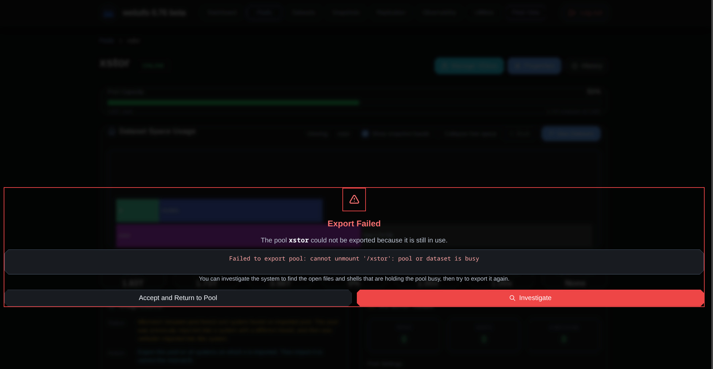
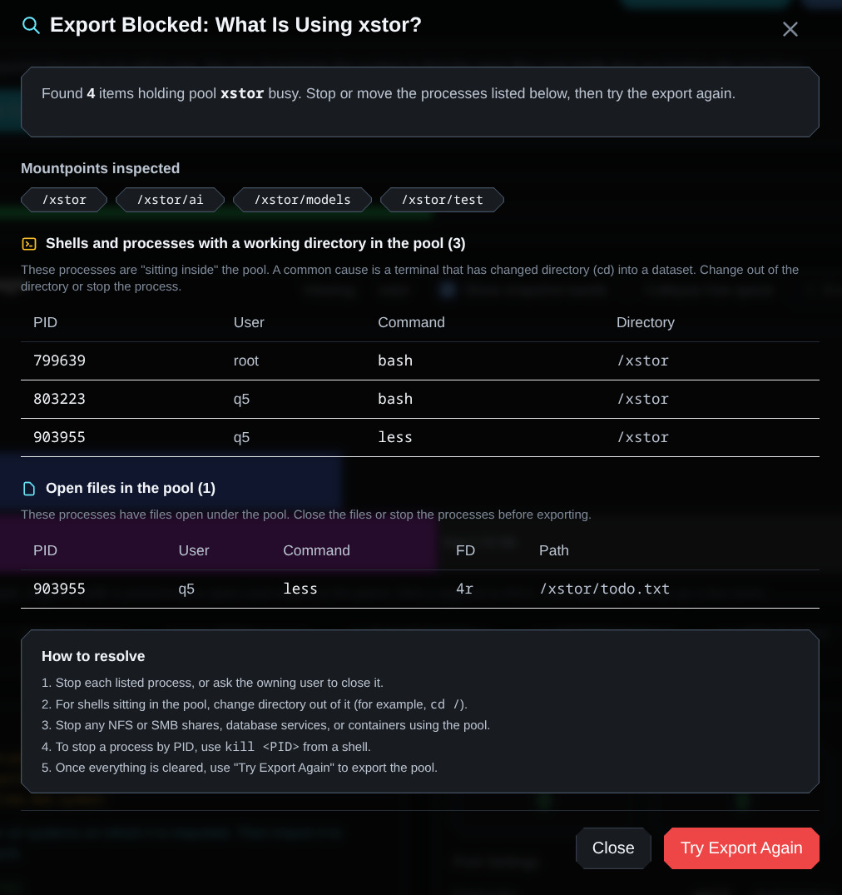

# Figuring Out Why a Pool Won't Export

We have all been here. You go to export a pool, hit the button, and ZFS politely tells you the pool is busy and refuses to budge. Something is still holding it, but ZFS won't tell you what. So you drop to a shell, start poking around with `lsof`, `fuser`, `fstat`, and `lslocks`, and try to track down the one shell you left sitting in a directory three weeks ago.

That whole dance is exactly what this new feature is meant to kill off. When a pool export fails because the pool is in use, WebZFS can now investigate the root cause for you, right from the web interface.

## What It Does

If an export fails and the error looks like a busy or in-use failure, WebZFS shows a clear "Export Failed" panel with the actual error text. From there you get two choices: accept it and go back to the pool, or click "Investigate."

When you investigate, WebZFS scans the system for the usual suspects that keep a pool pinned:

- Open files under the pool's mountpoints
- Shells and processes whose working directory is sitting inside the pool
- Advisory file locks held within the pool

It then lays all of that out in a single view, along with a short "how to resolve" checklist so you know what to close or kill before you try again. There is also a "Try Export Again" button so you don't have to go hunting for it.

## How It Works Under the Hood

Nothing surprising here, and that is the point. It uses the same tools you would reach for by hand. On Linux it runs `lsof` for open files and working directory holders, and `lslocks` for advisory locks. On FreeBSD it uses the base-system `fstat`. Everything runs through the existing privileged command layer, so a missing tool or a timeout gets reported as a note in the results rather than blowing up the whole page.

Staying true to the WebZFS philosophy, the investigation is completely read-only. It never kills a process or closes a file on its own. It reports what it finds it's up to you to decide how you want to resolve the situation. The destructive part stays in your hands where it belongs.

