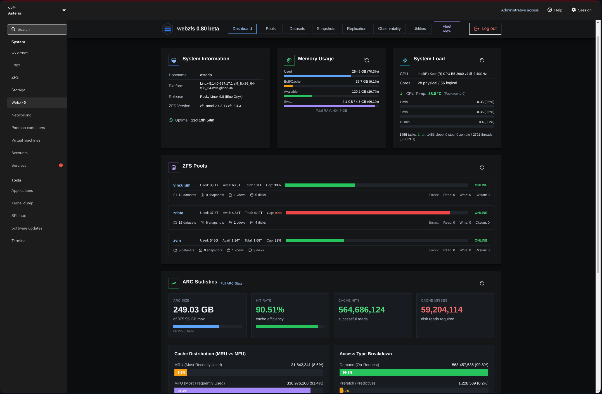

# WebZFS 0.80: Cockpit has landed

You can now use WebZFS directly in Cockpit. 

The state of ZFS UI's in Cockpit is kinda a weird thing.  I'm shocked it's still so bad.  45Drives made the Houston UI many many years ago. It was simple and it worked; but it didn't offer much. And over the years it seems like they just stopped caring. There's a ton of things that it doesn't do (or at least didn't do last time I checked). It seems like they got a MVP and then just decided that was good enough.

Before commiting to making Webzfs, I had considered a fresh native Cockpit intergration a long time ago, but since I wanted something with cross platform support, I quickly discarded that idea.  Cockpit is too tied into linux tooling to be easily ported to the BSDs. If someone wanted to, they'd have to rewrite massive portions of it, at which point what is the point, because it would be doubtful that the upstream cockpit project would ever accept changes at such a massive scale. 

But a few months ago I started thinking, could it go the other way, could WebZFS be run as a page inside Cockpit.  The answer is obviously yes. Took me a while to get my head around the way cockpit handles extensions, but I got there. 

Now there are a few caveats.  This is obviously the first version with this support so there will be bugs, I think I've found all the big ones, but there will be others.  Also you have to log into webzfs, the cockpit user session is not used for authentication.  That can probably be fixed, but I just haven't bothered to look into how it could be done. If someone wants to tackle that, by all means reach out.
I've been running this on my RockyLinux box for about a week now and have found a few things wrong here and there, but I think I've resolved most of the issues with random buttons not working properly. If you find a page that doesn't behave right, create a ticket so I can track it down.

So without further ado...

---
