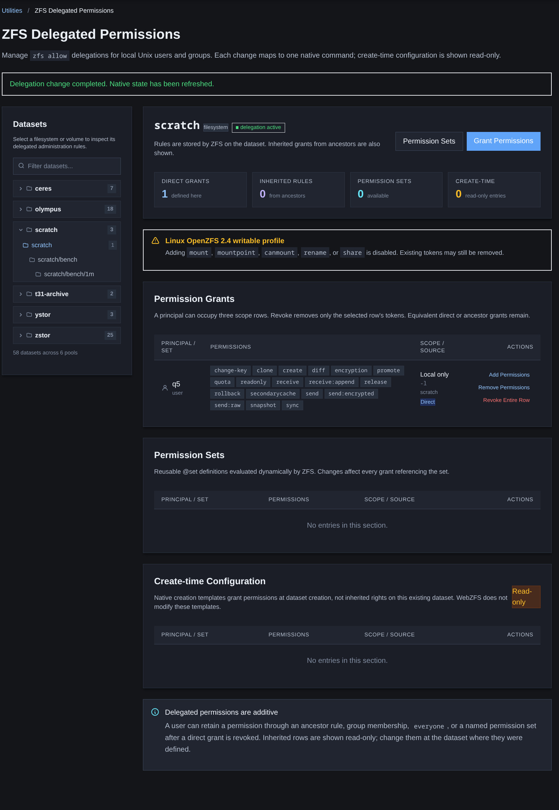
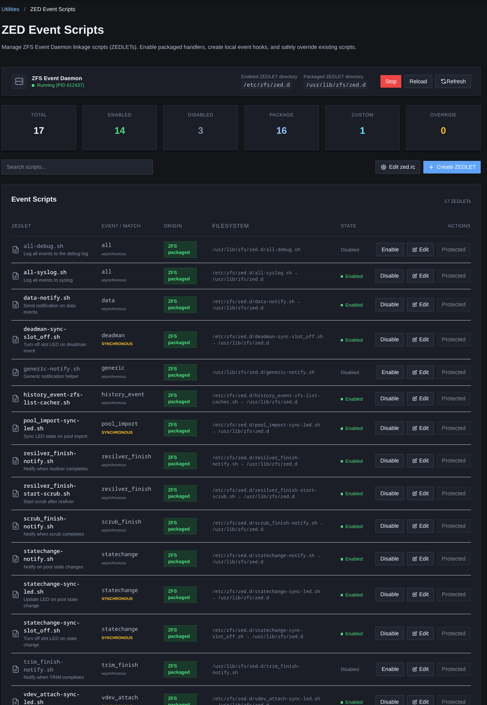
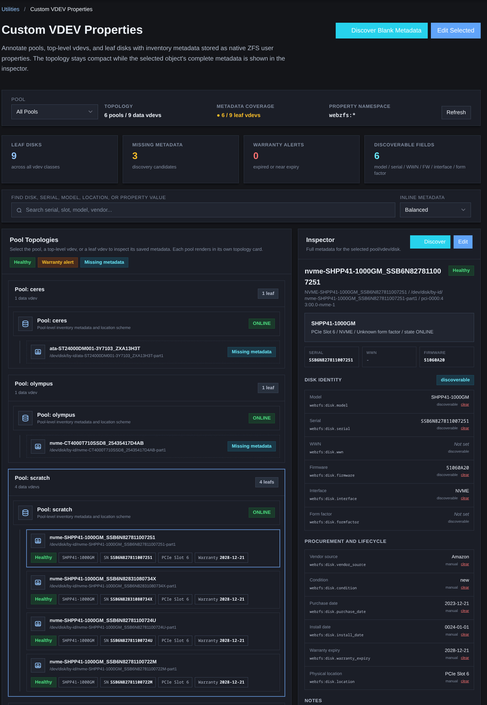
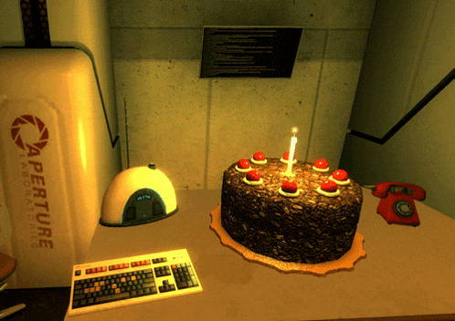

# WebZFS 0.85 : Speed running four minor versions

## Why speedrunning?

Because I forgot to branch off from 0.81 when making 0.82. Then I forgot to commit some things under 0.83 and went right to 0.84.  So what was going to go into 0.83, got bumped to 0.85. And there were a bunch of other fixes that needed to be done, as well as some housekeeping things.

I thought about pushing it all more slowly, but these are the last major changes I wanted to get in before 1.0-RELEASE, and ao I decided to go ahead and plow through, to give time for more testing before hitting RC and RELEASE.

## What's included

### Fixes

- Fix for a typo in the package-lock file
- Fix for systems that use sudo-rs
- Fix for load-key to actually function 
- add files I had missed in prior work
- Fix for SMART metrics and add temp support 
- Fix for newly required deps on FreeBSD
- Fix a missing user check for router security 
- Normalized router security

### New Features

#### ZFS Delegation

#### Zed Event Management

#### Custom vdev properties

## What comes next

- Hopefully no new features
- Normalized Modal vs separate edit pages.
- Building out the future testing process

And last but not least...

## Lots of testing...

`Cake and grief counseling will be available at the conclusion of the test.`   

---
